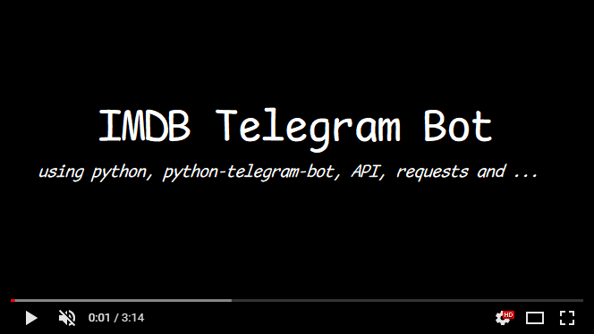

# IMDB Telegram Bot

Bilingual Telegram bot project, English and Farsi, which is integrated with The Movie Database (TMDB) API to get movie information and crawler to get movie download links. And it uses MongoDB to store received data, but it stores download links temporarily and for one day

## Description

This project allows users to interact with a Telegram bot that provides information on movies and TV shows using TMDB API data in both English and Farsi languages, which can be requested from the user when using the bot. It is asked and saved and the user can change it whenever he wants. Users can search for movies and TV series in several ways, by using the name of the movie or series with or without the /search command, or by receiving information about similar movies and TV series with the list/ command, which is displayed as a list. It will be displayed to the user along with the details (in this case, the download links will not be displayed to the user) or inline where you can use the bot such as [@gif](https://telegram.me/gif), [@pic](https://telegram.me/pic), [@vid](https://telegram.me/vid) bots which are examples of famous Telegram bots and Received the movie details along with the download link (if available). Also, the user can change the language of the robot using the command language/ and choose the desired language. In addition, the command help/ is also defined for the user, which changes according to the language of the bot, and the user can reach and use it from the menu button in the bot.
**It should be noted that this robot is written for educational purposes and its purpose is not copyright infringement, and we will not be held responsible for this.**

## Getting Started

Follow the steps below to get started with the project:

### Prerequisites

- Telegram account
- API key from [TMDB](themoviedb.org)
- Docker

### Installation

1. Create a bot in Telegram using [@botfather](https://t.me/botfather) and obtain the bot token.
2. Enable inline queries for your bot in [@botfather](https://t.me/botfather) and set a placeholder message for queries to your bot.
3. Enable inline feedback for your bot in [@botfather](https://t.me/botfather).
4. Create an account on [themoviedb.org](https://developer.themoviedb.org/docs/getting-started) and generate an API key.
5. Find your Telegram chat ID. you can get help from [@userdatailsbot](https://t.me/userdatailsbot)
6. Rename the `.env-sample` file to `.env`.
7. Open the `.env` file and replace the placeholder values with your actual information. Set the `TOKEN` variable to your Telegram bot token. Set `TMDB_API_KEY` and `TMDB_API_READ_ACCESS_TOKEN` to your TMDB API key. Set `DEVELOPER_CHAT_ID` to your Telegram chat ID.
8. Once you have updated the `.env` file, run the project using Docker.
```sh
docker-compose up --build -d
```
9. Your bot is now running and ready to use.

**Note:** If your bot receives a large amount of traffic and you want to handle it efficiently, it is recommended to deploy the bot with a webhook. This project uses polling for testing purposes.

## Usage

- Start a conversation with your bot on Telegram.
- Use various commands and messages to interact with the bot and get information about movies and TV shows.

## Contributing

Contributions to the project are welcome! If you have any ideas, bug fixes, or improvements, feel free to open an issue or submit a pull request.

## License

This project is licensed under the [MIT License](./LICENCE).

## Disclaimer

Please note that this project is for testing and educational purposes only. Use it responsibly and adhere to the terms and conditions of the services it integrates with.

Feel free to customize this README.md file based on your project's specific details and requirements. Add any additional sections or information that you think would be relevant to your project.


## Demo
Due to the existence of download links and the violation of copyright, the film was not posted on YouTube, and you can download and watch it. Note that the slow response speed in the demo video is due to the low speed of the Internet and there is no problem with bot.

<p align="center">
<a href="Telegram_IMDb_demo_bot.mp4"></a>
</p>
